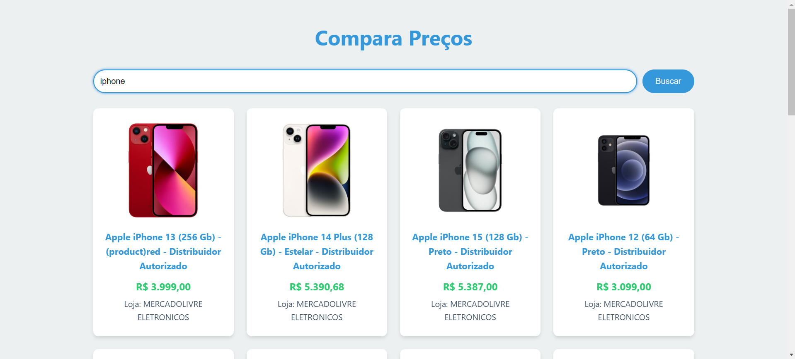

<h1 align="center"> Buscador de Preços ML </h1>

Projeto exclusivo de minha autoria & DevClub.

 

  

## 🚀 Tecnologias

Esse projeto foi desenvolvido com as seguintes tecnologias:

- HTML e CSS
- JavaScript
- Git e Github

## 💻 Projeto

O Projeto se trata de um buscador de preços que utiliza uma API do Mercado Livre e busca os preços dos itens com seus respectivos preços e gráficos de comparação.